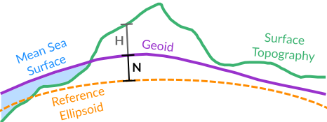

.. _reference-systems:

=================
Reference Systems
=================

Cartesian coordinate systems are represented by three perpendicular axes that are defined with respect to an origin, and with directions defined for each axis :cite:p:`Urban:2013vl`.
Locations of planetary bodies and satellites can be determined in an Earth-centered Earth-Fixed coordinate system (ECEF) :cite:p:`Meeus:1991vh,Montenbruck:1989uk`.
ECEF is a Cartesian coordinate system with :math:`x`, :math:`y`, and :math:`z` defined with respect to the Earth's center of mass.
The :math:`z` axis is aligned with the Earth's rotation axis, the :math:`x` axis is aligned with the intersection of the prime meridian and the equator, and the :math:`y` axis is aligned with 90\ |degree| east longitude and the equator.
The :math:`xy` plane is also called the equatorial plane.

.. plot:: ./background/geocentric-cartesian.py
    :caption: Geocentric Cartesian Coordinate System
    :align: center

As the shape of the Earth can be well approximated by an ellipsoid, positions on the Earth's surface are often described in terms of *geodetic coordinates*.
Geodetic coordinates (longitude :math:`\lambda`, latitude :math:`\varphi`, and height :math:`h`) are used to describe the position of a point on the Earth with respect to a defined ellipsoid.
Changing the terrestrial reference system can involve both translations and rotations of the reference system :cite:p:`Urban:2013vl`.
One method of transformation involves converting from a geographic coordinate system into a Cartesian coordinate system, and then performing matrix transformations [:ref:`Equation 6.1 <eq:6.1>`].

.. math::
    :label: 6.1
    :name: eq:6.1

    (\lambda, \varphi, h) &\rightarrow (x, y, z) \\
    (x, y, z) &\rightarrow (x', y', z') \\
    (x', y', z') &\rightarrow (\lambda', \varphi', h')

The transformation from ellipsoidal coordinates of a point in space to Cartesian coordinates is calculated by:

.. math::
    :label: 6.2
    :name: eq:6.2

    x &= (N + h)\cos{\varphi}\cos{\lambda}\\
    y &= (N + h)\cos{\varphi}\sin{\lambda}\\
    z &= \left((1 - e^2) N + h \right) \sin{\varphi}

.. math::
    :label: 6.3
    :name: eq:6.3

    N = \frac{a}{\sqrt{1 - e^2 \sin^2{\varphi}}}

.. math::
    :label: 6.4
    :name: eq:6.4

    e^2 = 2f - f^2

where :math:`N` is the radius of curvature in the prime vertical [:ref:`Equation 6.3 <eq:6.3>`], :math:`e` is the ellipsoidal eccentricity, with the squared eccentricity :math:`e^2` given by [:ref:`Equation 6.4 <eq:6.4>`], :math:`a` is the semi-major axis of the ellipsoid, and :math:`f` is the ellipsoidal flattening :cite:p:`HofmannWellenhof:2006hy,Urban:2013vl`.
Ellipsoid definitions typically specify the semi-major axis (:math:`a`) and flattening (:math:`f`), and datum definitions additionally include the coordinate system origin :cite:p:`HofmannWellenhof:2006hy,Urban:2013vl`.
In general, objects move with respect to the coordinate system, and the coordinate system itself moves and rotates in space :cite:p:`Urban:2013vl`.
Coordinate system definitions, such as the International Terrestrial Reference Frame (ITRF), will often include a time component to account for these changes.

Geocentric Coordinates
======================

Similar to ECEF cartesian coordinates, *geocentric coordinates* are defined with respect to the center of the Earth :cite:p:`HofmannWellenhof:2006hy,Snyder:1982gf`.
This is in contrast to geodetic coordinates, which are defined to have latitudes *normal* to the surface of the Earth.

.. plot:: ./background/geodetic-coordinates.py
    :caption: Geodetic and Geocentric Coordinates
    :align: center

Geocentric coordinates are used to estimate :ref:`spherical-harmonics` coefficients, and for performing coordinate system rotations.
Geocentric longitudes are identical to geodetic longitudes, but geocentric latitudes can differ from geodetic latitudes by approximately 0.2 degrees.
For applications using a spherical Earth model, the geocentric and geodetic latitudes are identical.

.. plot:: ./background/geocentric-latitude.py
    :caption: Difference between Geodetic and Geocentric Latitude
    :align: center

Geoid Height
============

Compared to the reference ellipsoid, a better representation of the figure of the Earth can be defined based on the Earth's gravitational field :cite:p:`Torge:2023bu`.
The :term:`geoid <Geoid>` is an *equipotential surface* set to coincide with an idealized global mean sea level (i.e. if the oceans were at rest) :cite:p:`HofmannWellenhof:2006hy`.
It serves as the reference surface to describe any topographic heights above (or below) mean sea level.
As with :ref:`solid-earth-tides`, the geoid has a :ref:`permanent tide <permanent-tide>` component due to the Earth being in the presence of the Sun and Moon :cite:p:`Makinen:2009dm,Torge:2023bu`.

The distances between the geoid and the reference ellipsoid are called *geoid height* or geoidal undulations (:math:`N`), and the distances between the geoid and points on the Earth's surface are called *orthometric heights* (:math:`H`) :cite:p:`HofmannWellenhof:2006hy`.

    Relationship between the reference ellipsoid, geoid, and surface topography :cite:p:`NRC:1997ea,Torge:2023bu`

.. _celestial-reference:

Celestial Reference Systems
===========================

Celestial reference systems are used to describe the positions of celestial bodies in the sky.
Transforming between celestial (:math:`\mathbf{x}_{CRS}`) and terrestrial (:math:`\mathbf{x}_{TRS}`) reference systems involves a set of transformation matrices for frame bias (:math:`\mathbf{B}`), precession (:math:`\mathbf{P}`), nutation (:math:`\mathbf{N}`), Earth's rotation (:math:`\mathbf{T}`), and polar motion (:math:`\mathbf{W}`) :cite:p:`Capitaine:2003fx,Capitaine:2003fw,Urban:2013vl`.

.. math::
    :label: 6.5
    :name: eq:6.5

    \mathbf{x}_{CRS} = \mathbf{B}\ \mathbf{P}\ \mathbf{N}\ \mathbf{T}\ \mathbf{W}\ \mathbf{x}_{TRS}

In ``pyTMD``, these transformations are used to convert planetary :term:`ephemerides <Ephemerides>` from a celestial reference frame to a terrestrial reference frame.

.. _barycentric-coordinates:

Barycentric Coordinates
=======================

Some tide models are computed using the finite-element method and defined on unstructured meshes.
These finite element meshes can use first-order (linear) or higher-order elements.
Linear triangular elements have their three nodes at the vertices (:math:`N_1`, :math:`N_2`, :math:`N_3`).
Quadratic triangular elements have three additional nodes at the edge midpoints.
The position of any point :math:`P` within a triangle can be expressed in terms areal weights known as **barycentric coordinates** :math:`(\xi, \eta, \lambda)`:

.. math::
    :label: 6.6
    :name: eq:6.6

    P = \xi \, P_1 + \eta \, P_2 + \lambda \, P_3

Geometrically, these weights are derived from the ratios of sub-triangle areas (:math:`A_1`, :math:`A_2`, :math:`A_3`) with respect to the total triangle area (:math:`A`):

.. math::
    :label: 6.7
    :name: eq:6.7

    \xi = \frac{A_1}{A}, \qquad
    \eta = \frac{A_2}{A}, \qquad
    \lambda = \frac{A_3}{A} = 1 - \xi - \eta

Here, :math:`A_1` is the area of the sub-triangle opposite :math:`N_1`, :math:`A_2` is the area of the sub-triangle opposite :math:`N_2`, and :math:`A_3` is the area of the sub-triangle opposite :math:`N_3`.

.. plot:: ./background/finite-elements.py
    :caption: Linear and quadratic triangular finite elements
    :width: 80%
    :align: center

The shape functions of finite elements have two important properties:

- **Kronecker delta property**: the shape functions are equal to one at their respective nodes and equal to zero at all other nodes
- **Partition of unity property**: the sum of the shape functions is equal to 1 for all points within the element

Because of these properties, barycentric coordinates can be used to help determine if a point is inside any given triangle:

- If all three barycentric coordinates are within :math:`[0, 1]`, then the point is inside the element.
- If any coordinate is negative or beyond that range, then the point lies outside that element.

.. important::
    Knowing the order of the nodes for each element is *crucial* for calculating the triangle areas and interpolation shape functions.

The standard order for nodes in linear triangular elements is counterclockwise.
For a global finite element mesh, an element with a clockwise order might straddle the model boundary.
``pyTMD`` checks the *winding number* of each element to determine the polygon orientation (clockwise or counterclockwise).
Quadratic elements can be more complicated and have different node orderings between the vertices and midside edges.
Some standard node orderings for quadratic elements are:

- counterclockwise (:math:`V_1\rightarrow` :math:`E_{12}\rightarrow` :math:`V_2\rightarrow` :math:`E_{23}\rightarrow` :math:`V_3\rightarrow` :math:`E_{31}`)
- vertices-to-midpoints (:math:`V_1\rightarrow` :math:`V_2\rightarrow` :math:`V_3\rightarrow` :math:`E_{12}\rightarrow` :math:`E_{23}\rightarrow` :math:`E_{31}`)
- vertices-to-opposite-midpoints (:math:`V_1\rightarrow` :math:`V_2\rightarrow` :math:`V_3\rightarrow` :math:`E_{23}\rightarrow` :math:`E_{31}\rightarrow` :math:`E_{12}`)

.. note::
    For quadratic elements, ``pyTMD`` presently only supports the counterclockwise node order for the unstructured ("native") FES models :cite:p:`Lyard:2025tr`.

.. |degree|    unicode:: U+00B0 .. DEGREE SIGN
